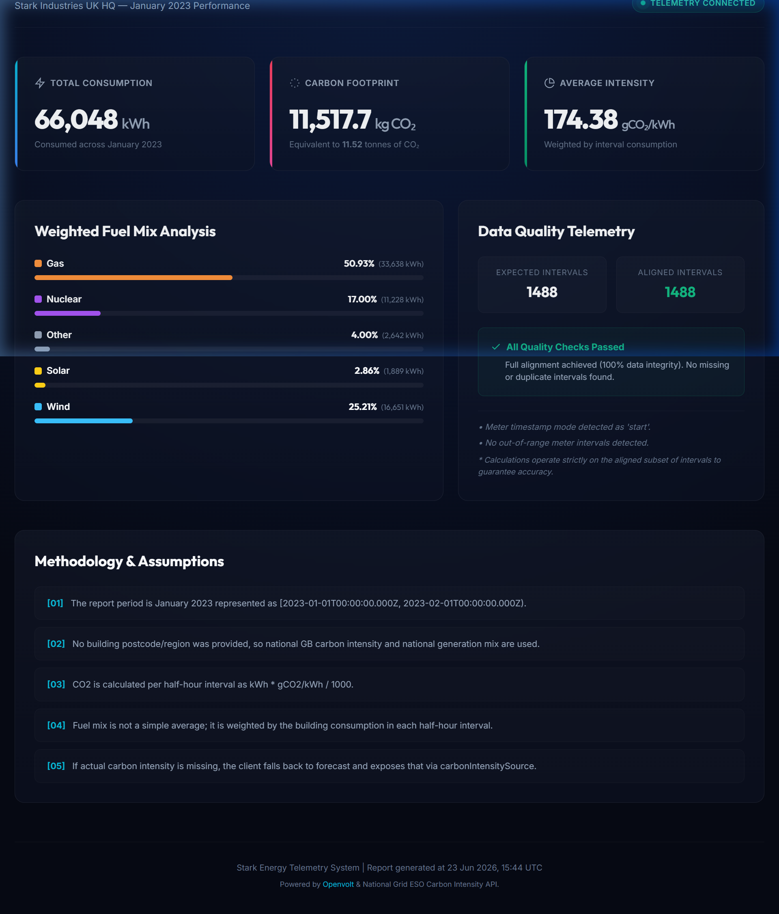

# Stark Industries UK HQ — January 2023 Energy & Carbon Report

This project is my implementation for the Openvolt founding software engineer challenge.

The goal is to calculate, for a commercial building in the UK:

1. Monthly energy consumed in January 2023, in kWh.
2. Monthly CO2 emitted by the electricity generated for the building, in kg.
3. Monthly fuel mix percentage, weighted by the building's half-hourly electricity consumption.

The intent is not to submit a throwaway script. The intent is to show how I approach a product/data problem as a founding engineer: clear assumptions, interval-level correctness, API boundaries, data quality checks, and a developer-friendly run path.

---

## Dashboard Preview



---

## Verification

Before submission, I verified the project with:

```bash
npm run report
npm run test
npm run typecheck
npm run build
npm run dashboard:build
```

---

## Why this design

Energy/carbon reporting is only trustworthy if the time alignment is correct.

A monthly total can hide many mistakes:

- missing half-hour readings
- duplicate intervals
- timestamp timezone drift
- using forecast carbon intensity when actual data exists
- averaging fuel mix percentages without weighting by actual consumption

This project treats every half-hour interval as the source of truth, aligns the three datasets, calculates from aligned intervals only, and exposes data-quality issues in the final report.

---

## Tech stack

- Node.js 20+
- TypeScript
- Native `fetch`
- Vitest for tests
- Markdown + JSON report output

I kept the implementation intentionally small. For a take-home challenge, dependency discipline is part of developer experience.

---

## Project structure

```text
openvolt-stark-energy-report/
  README.md
  MILESTONES.md
  SUBMISSION_NOTES.md
  package.json
  tsconfig.json
  .env.example
  src/
    index.ts
    config.ts
    clients/
      httpClient.ts
      openvoltClient.ts
      carbonIntensityClient.ts
    domain/
      types.ts
      time.ts
      intervalAlignment.ts
      energyCalculator.ts
      emissionsCalculator.ts
      fuelMixCalculator.ts
    fixtures/
      mockData.ts
    report/
      buildReport.ts
      writeJson.ts
      writeMarkdown.ts
  tests/
    dataQuality.test.ts
    emissionsCalculator.test.ts
    fuelMixCalculator.test.ts
  output/
    .gitkeep
```

---

## Setup

```bash
npm install
cp .env.example .env
```

Then paste the challenge API key into `.env`:

```bash
OPENVOLT_API_KEY="paste-the-challenge-x-api-key-here"
```

Do not commit `.env`.

---

## Run with mock data first

Use this to verify the full pipeline without calling external APIs:

```bash
npm run report:mock
```

This generates synthetic January 2023 half-hourly data and writes:

```text
output/stark-january-2023-report.json
output/stark-january-2023-report.md
```

Mock mode proves the pipeline works, but mock numbers should not be submitted as final challenge results.

---

## Run with real APIs

```bash
npm run report
```

This calls:

- Openvolt interval data API for the building meter.
- NESO/National Grid Carbon Intensity API for national GB carbon intensity.
- NESO/National Grid Carbon Intensity API for national GB generation mix.

---

## Calculation method

### 1. Monthly electricity consumed

```text
monthly_kwh = sum(interval_kwh)
```

### 2. Monthly CO2 emitted

Carbon intensity is in `gCO2/kWh`, so each interval is converted into kilograms:

```text
interval_co2_kg = interval_kwh * carbon_intensity_gco2_per_kwh / 1000
monthly_co2_kg = sum(interval_co2_kg)
```

### 3. Monthly weighted fuel mix

Fuel mix must be weighted by consumption:

```text
fuel_share[fuel] = sum(interval_kwh * interval_fuel_percentage[fuel]) / total_monthly_kwh
```

This matters because a half-hour where the building consumed 5 kWh should not have the same monthly influence as a half-hour where the building consumed 80 kWh.

---

## Time period

The challenge asks for January 2023.

This implementation represents that as:

```text
[2023-01-01T00:00:00.000Z, 2023-02-01T00:00:00.000Z)
```

That means start inclusive, end exclusive.

Expected half-hour interval count:

```text
31 days * 24 hours * 2 = 1488 intervals
```

---

## Data quality checks

The final report includes:

- expected half-hour interval count
- actual meter intervals received
- actual carbon intensity intervals received
- actual generation mix intervals received
- aligned intervals used for calculations
- missing meter intervals
- duplicate meter intervals
- missing carbon intervals
- missing generation mix intervals
- timestamp-mode detection notes

The calculation uses aligned intervals only.

---

## Assumptions

- The building is in the UK, but no postcode/region is provided.
- Because no postcode/region is provided, national GB carbon intensity and generation mix are used.
- All timestamps are normalized to UTC.
- The report period uses `[from, to)` semantics.
- Openvolt meter consumption values are treated as kWh.
- Actual carbon intensity is preferred; forecast is used only if actual is missing.
- Fuel mix is consumption-weighted, not a simple average of percentages.

---

## Commands

```bash
npm run report:mock   # local synthetic-data smoke test
npm run report        # real API run
npm run test          # unit tests
npm run typecheck     # TypeScript validation
npm run build         # compile to dist/
```

---

## What I would improve next

If this were moving toward production, I would add:

- persisted raw API snapshots for auditability
- retry/backoff policy around external API calls
- explicit regional carbon calculation if building postcode is available
- small Vue dashboard that reads the JSON report
- CSV export for finance/ESG teams
- TimescaleDB storage for historical interval analytics

---

## Final deliverables

After running the real API command, submit:

- the GitHub repo or zip file
- generated Markdown report
- generated JSON report
- a short application email explaining the product and data-quality decisions
